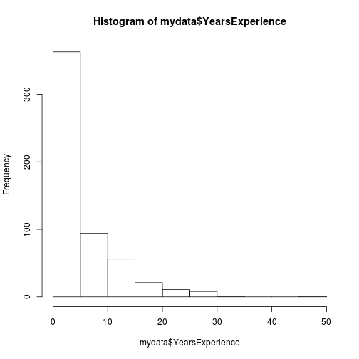

# Analysing the analysers - the sequel


```r
# run following two lines from the CLI; will then generate the rest ofthe HTML file
# setwd("dssurvey_new")
# library("knitr"); knit2html("analyse.Rmd")
source("readdata.R"); mydata <- readdata("data/Gegevens_Allemaal_150413.zip")
```

```
## Warning in read.table("Sheet_1.csv", header = TRUE, sep = ","): line 2
## appears to contain embedded nulls
```

```
## Warning in readdata("data/Gegevens_Allemaal_150413.zip"): NAs introduced
## by coercion
```

```r
source("geolocate.R")
library(ggplot2, quietly=TRUE)
library(ggmap, quietly=TRUE)
library(dplyr, quietly=TRUE)
library(reshape2, quietly=TRUE)
```

## Number of responses
How many responses did we get, and how complete were they?


```r
dat <- tbl_df(mydata)
completed <- matrix(rep(0, 15*nrow(mydata)), ncol=15)
completed[, 1] <- !is.na(dat$Age)
completed[, 2] <- !is.na(dat$Gender)
completed[, 3] <- dat$OrganisationType!="" | dat$OrganisationTypeOther==""
completed[, 4] <- !is.na(dat$OrganisationSize)
completed[, 5] <- dat$HierarchyOrganisation!=""
completed[, 6] <- apply((select(dat, starts_with("Role"))!=""), 1, sum)>0
completed[, 7] <- is.na(dat$OrganisationIndustry)!="" & dat$OrganisationIndustryOther==""
completed[, 8] <- dat$Degree!="" | dat$DegreeOther!=""
completed[, 9] <- apply((select(dat, starts_with("Studies"))!=""), 1, sum)>0
completed[, 10] <- !is.na(dat$YearsExperience)
completed[, 11] <- apply((select(dat, starts_with("Skills"))!=""), 1, sum)>0
completed[, 12] <- apply((select(dat, starts_with("Type"))!=""), 1, sum)>0
completed[, 13] <- apply((select(dat, starts_with("Motivation"))!=""), 1, sum)>0
completed[, 14] <- apply((select(dat, starts_with("Activities"))!=""), 1, sum)>0
completed[, 15] <- apply((select(dat, starts_with("Training"))!=""), 1, sum)>0
completed[is.na(completed[, ])] <- 0
colnames(completed) <- c("Age", "Gender", "OrganisationType", "OrganisationSize", 
		"Hierarchy", "Role", "Industry", "Degree", "Studies", "Experience",
		"Skills", "Type", "Motivation", "Activities", "Training")
# R classic plot
# barplot(apply(completed, 2, sum), las=2)

# ggplot2
tmp <- melt(completed)
tmp <- tmp[tmp$value!=0, ]
names(tmp)[2] <- "question" 
ggplot(tmp, aes(question)) + 
		geom_bar() +
		theme(axis.text.x=element_text(angle=90, hjust=1))
```

 

There is a downward trend, but not too bad, in spite of the length of the survey.

## Time and date

```r
## R classic plot
#hist(as.numeric(strftime(mydata$StartDate, format="%H")),
#		breaks=0:24, main="Time of day", 
#		xlab="time", xlim=c(0, 24), include.lowest=FALSE, right=FALSE)

# time of day the survey was started - ggplot
timeOfDay <- as.data.frame( as.numeric(strftime(mydata$StartDate, format="%H")))
names(timeOfDay) <- c("Time of Day")
ggplot(data=timeOfDay, aes(x=`Time of Day`)) + geom_histogram(binwidth=1)
```

 

Note - time is in GMT, so one or two hours different from the time on the clock.
Need to do transform and derive time on the clock if we want to say something about 
behaviour of Data Scientists.


```r
day <- as.numeric(strftime(mydata$StartDate, format="%d"))
month <- as.numeric(strftime(mydata$StartDate, format="%m"))
date <- day + ifelse(month==4, 31, 0)
#hist(date,
#		breaks=10:47, main="Day of month", 
#		xlab="day", include.lowest=FALSE, right=FALSE,
#		xaxt="n")
#axis(1, at=10:47, labels=c(10:31, 1:16))

# cumulative plot
plot(mydata$StartDate[order(mydata$StartDate)], 1:length(mydata$StartDate), 
		xlab="Date & time response received", ylab="Cumulative number of replies", type="p")
```

 

```r
# date - ggplot2
dayOfMonth <- as.data.frame(date)
names(dayOfMonth) <- c("Day of Month")
ggplot(data=dayOfMonth, aes(x=`Day of Month`)) + 
		geom_histogram(binwidth=1) +
		scale_x_continuous(breaks=10:47, labels=c(10:31, 1:16))
```

 

## Where do the responses come from?
Will show a map of geolocation of IP addresses

```r
pos <- geoip(as.character(mydata$IP.Address)) # function from geolocate.R
```

```
## Warning in file(con, "r"): unable to connect to 'freegeoip.net' on port
## 80.
```

```
## Error in file(con, "r"): cannot open the connection
```

```r
pos <- pos[, c("latitude", "longitude")]
```

```
## Error in eval(expr, envir, enclos): object 'pos' not found
```

```r
get_belgium <- get_map(c(4.5,51), zoom=7)
```

```
## Map from URL : http://maps.googleapis.com/maps/api/staticmap?center=51,4.5&zoom=7&size=640x640&scale=2&maptype=terrain&language=en-EN&sensor=false
```

```r
belgium <- ggmap(get_belgium) # actualy shows Belgium, Holland and north of France (south to Paris)
belgium + 
		geom_point(aes(x=longitude, y=latitude), data=pos, col="red")
```

```
## Error in do.call("layer", list(mapping = mapping, data = data, stat = stat, : object 'pos' not found
```


## Age and gender

```r
counts <- table(mydata$Age)
op <- par(mar = c(12,4,4,2) + 0.1)
barplot(counts, las=2)
```

 

```r
counts <- table(mydata$Gender)
op <- par(mar = c(8 ,4,4,2) + 0.1)
barplot(counts)
```

 

```r
responded <- sum(counts)
skipped <- nrow(mydata)-responded

op <- par(mar = c(4 ,8,4,2) + 0.1)
boxplot(as.numeric(Age)~Gender, data=mydata, yaxt="n", notch=FALSE)
axis(2, at=as.numeric(mydata$Age), labels=mydata$Age, las=2)
```

 

Responded: 590; skipped: 0

## Organisation

```r
counts <- table(mydata$OrganisationType)
counts <- counts[-1]
op <- par(mar = c(12,4,4,2) + 0.1)
barplot(counts, las=2)
```

 

```r
par(op)
responded <- sum(counts)
skipped <- nrow(mydata)-responded
```

Responded: 562; skipped: 28


```r
d <- as.numeric(as.character(mydata$OrganisationSize))
d <- d[!is.na(d)]; d <- d[d!=1234567]
hist(log(d), xlab="log(Organisation size)", main="Organisation size")
```

 

```r
# axis(1, exp(r$breaks), las=2)
responded <- length(d); skipped=nrow(mydata)-responded
```

Responded: 538; skipped: 52

## Responsibilities and role

```r
op <- par(mar = c(12,4,4,2) + 0.1)
counts <- table(mydata$HierarchyOrganisation)
names(counts) <- c("", "First-line manager", "Middle-level mamager", "No management resp.", "Top level")
counts <- counts[-1]
barplot(counts, las=2)
```

 

```r
responded <- sum(counts); skipped <- nrow(mydata)-responded
```

Responded: 562; skipped: 28


```r
RoleMarketing <- sum(mydata$RoleMarketing=="Marketing")
RoleSales <- sum(mydata$RoleSales=="Sales")
RoleFinance <- sum(mydata$RoleFinance=="Finance")
RoleProduction <- sum(mydata$RoleProduction=="Production")
RoleR_D <- sum(mydata$RoleR_D=="R&D")
RoleIT <- sum(mydata$RoleIT=="IT")
RoleSupport <- sum(mydata$RoleSupport=="Support")
counts <- c(RoleMarketing, RoleSales, RoleFinance, RoleProduction, RoleR_D, RoleIT, RoleSupport)
names(counts) <- c("Marketing", "Sales", "Finance", "Production", "R&D", "IT", "Support")
op <- par(mar = c(8,4,4,2) + 0.1)
barplot(counts, las=2)
```

 

```r
responded <- sum(counts); skipped <- nrow(mydata)-responded
```

Responded: 762; skipped: -172

```r
counts <- table(mydata$OrganisationIndustry)
counts <- counts[-1]
names(counts)[1] <- "Communications, etc."
names(counts)[6] <- "Healthcare, etc."
names(counts)[10] <- "Other"
op <- par(mar = c(12,4,4,2) + 0.1)
barplot(counts, las=2)
```

 

```r
responded <- sum(counts); skipped <- nrow(mydata)-responded
```

Responded: 557; skipped: 33

## Education

```r
degreeLevels <- c("", "No higher education", "Bachelor", "Master", "Master after Master", "PhD", "Other (please specify)")
tmp <- as.character(mydata$Degree)
mydata$Degree <- factor(tmp, levels=degreeLevels, ordered=TRUE)
levels(mydata$Degree) <- c("", "No higher education", "Bachelor", "Master", "Master after Master", "PhD", "Other")
counts <- table(mydata$Degree)
counts <- counts[-1]
barplot(counts, las=2)
```

 

```r
responded <- sum(counts); skipped <- nrow(mydata)-responded
```

Responded: 555; skipped: 35

```r
studiesLevels <- c("StudiesScience", "StudiesEngineering", "StudiesICT", "StudiesCommerce", "StudiesSocial", "StudiesLaw", "StudiesOther")
studiesCounts <- rep(0, length(studiesLevels))
for(i in 1:length(studiesLevels)) studiesCounts[i] <- sum(mydata[, studiesLevels[i]]!="")
studiesNames <- c("Science or Math", "Engineering", "ICT", "Commerce", "Social", "Law", "Other")
names(studiesCounts) <- studiesNames
barplot(studiesCounts, las=2)
```

 

## Experience

```r
hist(mydata$YearsExperience)
```

 

## Skills

```r
# names(mydata)[32:53]
skills <- mydata[, names(mydata)[grepl("^Skills", names(mydata)) & !grepl("Other$", names(mydata))]]
names(skills) <- sub("^Skills", "", names(skills))
test1 <- apply(skills, 1, var)
skills <- skills[(test1>0), ]
test2 <- rep(0, nrow(skills))
for(i in 1:nrow(skills)) test2[i] <- sum(is.na(skills[i,]))
skills <- skills[test2==0,]
scaledSkills <- skills
for(i in 1:nrow(skills)) scaledSkills[i, ] <- rank(skills[i, ])
op <- par(mar = c(12,4,4,2) + 0.1)
tmp <- names(scaledSkills)
names(scaledSkills) <- c("Algorithms", "Back-end programming", "Bayesian/Monte Carlo", "Big Data", 
		"Business", "Statistics", "Data Management", "Front-end programming", "Graphs", "Machine Learning",
		"Math", "Optimisation", "Product dev.", "Science", "Simulation", "GIS", "SQL", "Surveys",
		"Sys. Administration", "Temporal stats", "NoSQL", "Vizualisation")
boxplot(scaledSkills, las=2)
```

 

```r
names(scaledSkills) <- tmp

cm <- cor(scaledSkills, use="complete.obs", method="pearson")

library(ggplot2)
library(reshape2)
ggplot(melt(cm), aes(Var1, Var2, fill=value)) + geom_tile() +
		scale_fill_gradient2(limits=c(-1, 1)) +
		theme(axis.text.x=element_text(angle=-90, hjust=0))
```

 

```r
# NMF stuff moved to separate file

d <- dist(scaledSkills)
h <- hclust(d)
plot(h)
```

 

```r
dsScore <- apply(scaledSkills, 1, sum) # all sum to 253 (=sum(1:22)), as wanted


p <- prcomp(scaledSkills)
biplot(p, xlabs=rep(".", nrow(scaledSkills)))
```

 

```r
screeplot(p)
```

 

```r
scree <- p$sdev^2; names(scree) <- 1:length(scree)
barplot(scree, xlab="Principal component", ylab="variance explained")
```

 

```r
cumscree <- cumsum(scree); barplot(cumscree/cumscree[length(cumscree)])
```

 

```r
d <- dist(t(scaledSkills))
h <- hclust(d)
op <- par(mar = c(8,4,4,2) + 0.1)
plot(h, xlab="")
```

 

```r
skillScore <- apply(scaledSkills, 2, sum)/(nrow(scaledSkills)*ncol(scaledSkills))
op <- par(mar = c(12,4,4,2) + 0.1)
barplot(skillScore[order(skillScore)], las=2)
```

 

```r
#axis(1, at=1:22, labels=names(scaledSkills), las=2)
par(op)
```

## Data Scientist types

```r
# names(mydata)[55:65]
types <- mydata[, names(mydata)[grepl("^Type", names(mydata)) & !grepl("Other$", names(mydata))]]
for(i in 1:ncol(types)) {
	types[, i] <- as.character(types[, i])
	types[types[, i]=="", i] <- "0" 
	types[types[, i]=="Maybe", i] <- "3" 
	types[types[, i]=="Maybe a bit", i] <- "2" 
	types[types[, i]=="Not at all", i] <- "1" 
	types[types[, i]=="Yes, but not completely", i] <- "4" 
	types[types[, i]=="Yes, definitely", i] <- "5"
	types[, i] <- as.numeric(types[, i])
}
colnames(types) <- sub("^Type", "", names(types))
colnames(types)[1] <- "Developer"
colnames(types)[5] <- "Statistician"
colnames(types)[6] <- "Jack-of-all-trades"
test1 <- apply(types, 1, var)
types <- types[(test1>0), ]
test2 <- apply(types, 1, sum)
types <- types[(test2>0), ]
scaledTypes <- types
for(i in 1:nrow(types)) scaledTypes[i, ] <- rank(types[i, ])
op <- par(mar = c(8,4,4,2) + 0.1)
boxplot(scaledTypes, las=2)
```

 

```r
cm <- cor(scaledTypes, use="complete.obs", method="pearson")

ggplot(melt(cm), aes(Var1, Var2, fill=value)) + geom_tile() +
		scale_fill_gradient2(limits=c(-1, 1)) +
		theme(axis.text.x=element_text(angle=-90, hjust=0))
```

 

```r
# NMF moved to separate .Rmd file

typeScore <- apply(scaledTypes, 2, sum)/(nrow(scaledTypes)*ncol(scaledTypes))
op <- par(mar = c(8,4,4,2) + 0.1)
barplot(typeScore[order(typeScore)], las=2)
```

 

```r
#axis(1, at=1:22, labels=names(scaledTypes), las=2)
par(op)

d <- dist(scaledTypes)
h <- hclust(d)
op <- par(mar = c(8,4,4,2) + 0.1)
plot(h, xlab="")
```

 

```r
d <- dist(t(scaledTypes))
h <- hclust(d)
op <- par(mar = c(8,4,4,2) + 0.1)
plot(h, xlab="")
```

 

## Motivation to attend meetup evenings

```r
#names(mydata[, 67:75])
motivationNames <- names(mydata[, 67:75])
motivationCounts <- rep(0, length(motivationNames))
for(i in 1:length(motivationNames)) motivationCounts[i] <- sum(mydata[, motivationNames[i]]!="")
motivationDisplayNames <- c("Doesn't attend", "Socialising", "Business to Business", "Meeting employers", "Meeting employees", "Developments global", "Developments Belgium", "Contributing", "Other")
names(motivationCounts) <- motivationDisplayNames
op <- par(mar = c(12,4,4,2) + 0.1)
barplot(motivationCounts, las=2)
```

 

```r
respondents <- sum(counts)
respondents
```

```
## [1] 555
```

```r
nrow(mydata)-respondents
```

```
## [1] 35
```

## Activities

```r
#names(mydata)[77:82]
scaledActivities <- mydata[, 77:81]
for(i in 1:ncol(scaledActivities)) {
	scaledActivities[, i] <- as.character(scaledActivities[, i])
	scaledActivities[scaledActivities[, i]=="", i] <- "0" 
	scaledActivities[scaledActivities[, i]=="No, not our role", i] <- "1" 
	scaledActivities[scaledActivities[, i]=="No opinion either way", i] <- "3" 
	scaledActivities[scaledActivities[, i]=="Probably not our role", i] <- "2" 
	scaledActivities[scaledActivities[, i]=="Yes, probably", i] <- "4" 
	scaledActivities[scaledActivities[, i]=="Yes, definitely", i] <- "5"
	scaledActivities[, i] <- as.numeric(scaledActivities[, i])
}
colnames(scaledActivities) <- sub("^Activities", "", names(scaledActivities))
test1 <- apply(scaledActivities, 1, var)
scaledActivities <- scaledActivities[(test1>0), ]
test2 <- apply(scaledActivities, 1, sum)
scaledActivities <- scaledActivities[(test2>0), ]
for(i in 1:nrow(scaledActivities)) scaledActivities[i, ] <- rank(scaledActivities[i, ])
op <- par(mar = c(8,4,4,2) + 0.1)
boxplot(scaledActivities, las=2)
```

 

```r
responded <- nrow(scaledActivities)
skipped <- nrow(mydata)-responses
```

```
## Error in eval(expr, envir, enclos): object 'responses' not found
```

```r
activityScore <- apply(scaledActivities, 2, sum)/(nrow(scaledActivities)*ncol(scaledActivities))
op <- par(mar = c(8,4,4,2) + 0.1)
barplot(activityScore[order(activityScore)], las=2)
```

 

## Training

```r
# names(mydata)[83:87]
scaledTraining <- mydata[, 83:87]
for(i in 1:ncol(scaledTraining)) {
	scaledTraining[, i] <- as.character(scaledTraining[, i])
	scaledTraining[scaledTraining[, i]=="", i] <- "0" 
	scaledTraining[scaledTraining[, i]=="No, not our role", i] <- "1" 
	scaledTraining[scaledTraining[, i]=="No opinion either way", i] <- "3" 
	scaledTraining[scaledTraining[, i]=="Probably not our role", i] <- "2" 
	scaledTraining[scaledTraining[, i]=="Yes, probably", i] <- "4" 
	scaledTraining[scaledTraining[, i]=="Yes, definitely", i] <- "5"
	scaledTraining[, i] <- as.numeric(scaledTraining[, i])
}
colnames(scaledTraining) <- sub("^Training", "", names(scaledTraining))
test1 <- apply(scaledTraining, 1, var)
scaledTraining <- scaledTraining[(test1>0), ]
test2 <- apply(scaledTraining, 1, sum)
scaledTraining <- scaledTraining[(test2>0), ]
for(i in 1:nrow(scaledTraining)) scaledTraining[i, ] <- rank(scaledTraining[i, ])
op <- par(mar = c(8,4,4,2) + 0.1)
boxplot(scaledTraining, las=2)
```

 

```r
responded <- nrow(scaledTraining)
skipped <- nrow(mydata)-responded

trainingScore <- apply(scaledTraining, 2, sum)/(nrow(scaledTraining)*ncol(scaledTraining))
op <- par(mar = c(8,4,4,2) + 0.1)
barplot(trainingScore[order(trainingScore)], las=2)
```

 
