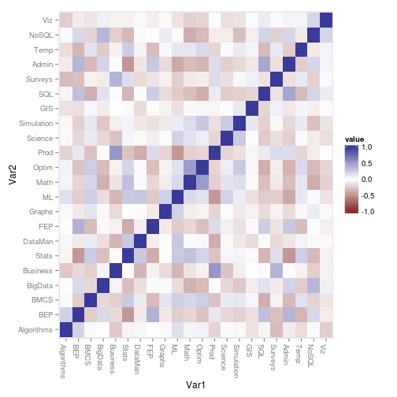
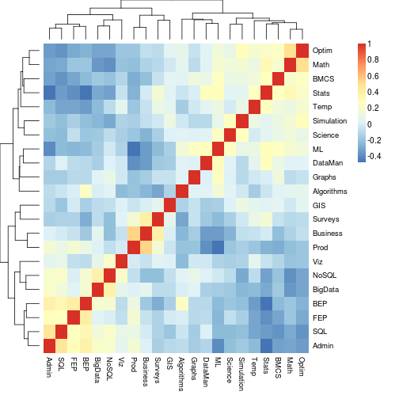
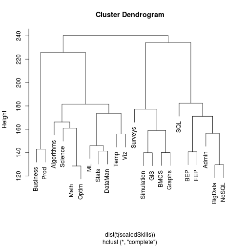
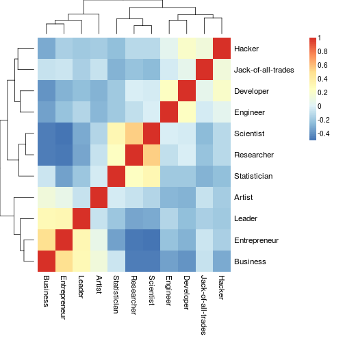
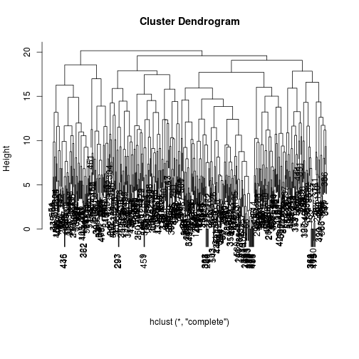
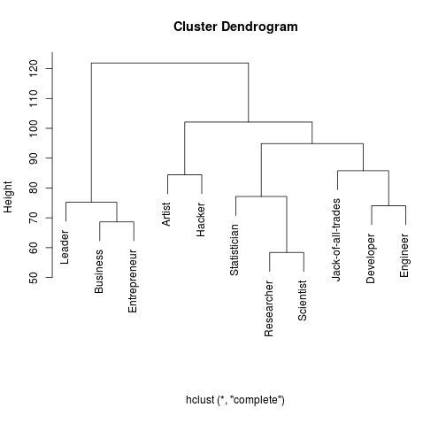
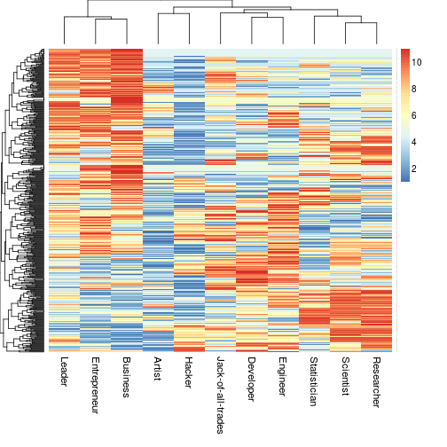
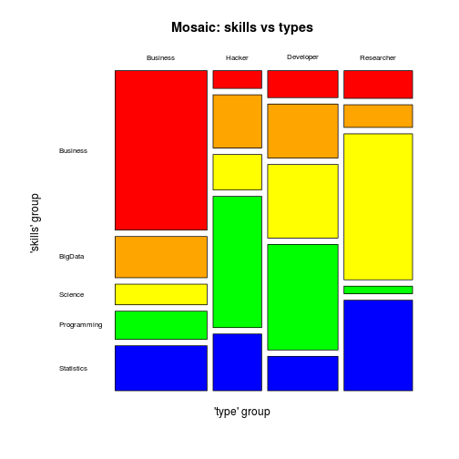
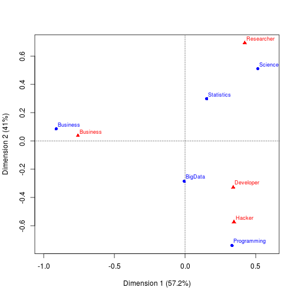

# Analysing the analysers - the sequel

## Intro
What are we trying to do? Describe the analysis by Harris et al.; our survey;
connection to the Data Innovation Summit

This is the second part, with mainly the results from the Non-negative Matrix Factorisation
which we did following the publication by Harris et al.

## Preliminaries
from outside markdown script: set working directory, load knitr package

From within this script: set read data, load libraries...


## Skills
Extracting the 'skills' data from the main data frame, excluding some faked data, renaming columns...

```r
skills <- mydata[, names(mydata)[grepl("^Skills", names(mydata)) & !grepl("Other$", names(mydata))]]
names(skills) <- sub("^Skills", "", names(skills))
test1 <- apply(skills, 1, var)
skills <- skills[(test1>0), ]
test2 <- rep(0, nrow(skills))
for(i in 1:nrow(skills)) test2[i] <- sum(is.na(skills[i,]))
skills <- skills[test2==0,]
scaledSkills <- skills
for(i in 1:nrow(skills)) scaledSkills[i, ] <- rank(skills[i, ])
op <- par(mar = c(12,4,4,2) + 0.1)

cm <- cor(scaledSkills, use="complete.obs", method="pearson")

ggplot(melt(cm), aes(Var1, Var2, fill=value)) + geom_tile() +
		scale_fill_gradient2(limits=c(-1, 1)) +
		theme(axis.text.x=element_text(angle=-90, hjust=0))
```

 

```r
aheatmap(cm)
```

 


```r
plot(hclust(dist(t(scaledSkills))))
```

 

The following chunk takes quite a bit of time to execute - we set the number of replicate runs to 512.

```r
# dim(scaledSkills) is 489x22, which we'll factorise to 489x5 * 5x22
res <- nmf(scaledSkills, 5, nrun=512, seed=123456)
h <- coef(res); dim(h)
```

```
## [1]  5 22
```

```r
h <- t(scale(t(h))) # scaling - only done because Harris did it; seems to make little difference
H <- data.frame(t(h), Group=sapply(1:ncol(h), function(i) which.max(t(h)[i,])))
skillsH <- H

# group 1: Business, Prod, GIS, Surveys
# group 2: Stats, DataMan, Temp, Viz
# group 3: BEP, FEP, SQL, Admin
# group 4: Algorithms, BigData, Graphs, NoSQL
# group 5: BMCS, ML, Math, Optim, Science, Simulation
sGN <- c("Business", "Statistics", "Programming", "BigData", "Science")
# note: Harris' category "Math" now renamed as "Science"

w <- basis(res)
w <- scale(w) # again - only done because Harris did it; seems to make little difference
W <- data.frame(w, Group=sapply(1:nrow(w), function(i) which.max(w[i, ])))
skillsW <- W
```

## Types
reading the types data

```r
types <- mydata[, names(mydata)[grepl("^Type", names(mydata)) & !grepl("Other$", names(mydata))]]
for(i in 1:ncol(types)) {
	types[, i] <- as.character(types[, i])
	types[types[, i]=="", i] <- "0" 
	types[types[, i]=="Maybe", i] <- "3" 
	types[types[, i]=="Maybe a bit", i] <- "2" 
	types[types[, i]=="Not at all", i] <- "1" 
	types[types[, i]=="Yes, but not completely", i] <- "4" 
	types[types[, i]=="Yes, definitely", i] <- "5"
	types[, i] <- as.numeric(types[, i])
}
colnames(types) <- sub("^Type", "", names(types))
colnames(types)[1] <- "Developer"
colnames(types)[5] <- "Statistician"
colnames(types)[6] <- "Jack-of-all-trades"
test1 <- apply(types, 1, var)
types <- types[(test1>0), ]
test2 <- apply(types, 1, sum)
types <- types[(test2>0), ]
scaledTypes <- types
for(i in 1:nrow(types)) scaledTypes[i, ] <- rank(types[i, ])

cm <- cor(scaledTypes, use="complete.obs", method="pearson")

aheatmap(cm)
```

 

```r
d <- dist(scaledTypes)
h <- hclust(d)
op <- par(mar = c(8,4,4,2) + 0.1)
plot(h, xlab="")
```

 

```r
d <- dist(t(scaledTypes))
h <- hclust(d)
op <- par(mar = c(8,4,4,2) + 0.1)
plot(h, xlab="")
```

 

```r
aheatmap(scaledTypes)
```

 

Non-negative Matrix Factorisation of the types

```r
# dim(scaledTypes) is 482x11, which we'll factorise to 482x4 * 4x11
res <- nmf(scaledTypes, 4, nrun=512, seed=123456)
h <- coef(res)
h <- t(scale(t(h))) # scaling - only done because Harris did it; seems to make little difference
H <- data.frame(t(h), Group=sapply(1:ncol(h), function(i) which.max(t(h)[i,])))
typesH <- H
# group 1: Researcher, Scientist, Statistician
# group 2: Jack-of-all-trades, Hacker
# group 3: Artist, Leader, Business, Enterpreneur
# group 4: Developer, Engineer
tGN <- c("Researcher", "Hacker", "Business", "Developer")

w <- basis(res)
w <- scale(w)
W <- data.frame(w, Group=sapply(1:nrow(w), function(i) which.max(w[i, ])))
typesW <- W
```

## Pulling the two together

```r
sW <- data.frame(respID=rownames(skillsW), sGroup=skillsW$Group); 
tW <- data.frame(respID=rownames(typesW), tGroup=typesW$Group)
jW <- merge(sW, tW, by="respID", all=FALSE)
jW$sGroup <- as.factor(jW$sGroup); levels(jW$sGroup) <- sGN
jW$sGroup <- factor(jW$sGroup, levels(jW$sGroup)[c(1, 4, 5, 3, 2)]) 
jW$tGroup <- as.factor(jW$tGroup); levels(jW$tGroup) <- tGN 
jW$tGroup <- factor(jW$tGroup, levels(jW$tGroup)[c(3, 2, 4, 1)]) 
nrows <- nrow(jW)
```

We have 477 rows in our sample for which we have a valid response to questions 11 and 13.

 

Compares well with the results from Harris et al. - maybe a little less corelation between the types and skills. Maybe need to do
some more quality control. Participants to Harris' survey might well have been better motivated. 
Respondents to our survey might have been incentivised only by the prospect of free entrance
to the Data Innovation Summit.

## Statistics on the association between skills and types
a couple of stats; 
following http://cran.us.r-project.org/web/packages/vcdExtra/vignettes/vcd-tutorial.pdf


```
## 
##  
##    Cell Contents
## |-------------------------|
## |                       N |
## | Chi-square contribution |
## |-------------------------|
## 
##  
## Total Observations in Table:  477 
## 
##  
##              |  
##              |     Hacker |   Business |  Developer | Researcher |  Row Total | 
## -------------|------------|------------|------------|------------|------------|
##     Business |          5 |         85 |         11 |         11 |        112 | 
##              |     10.771 |     62.856 |     10.471 |      9.876 |            | 
## -------------|------------|------------|------------|------------|------------|
##  Programming |         37 |         15 |         43 |          3 |         98 | 
##              |     23.334 |      9.231 |     13.652 |     18.412 |            | 
## -------------|------------|------------|------------|------------|------------|
##      BigData |         15 |         22 |         22 |          9 |         68 | 
##              |      0.848 |      0.007 |      1.400 |      3.536 |            | 
## -------------|------------|------------|------------|------------|------------|
##   Statistics |         16 |         24 |         14 |         36 |         90 | 
##              |      0.007 |      1.067 |      3.298 |      8.783 |            | 
## -------------|------------|------------|------------|------------|------------|
##      Science |         10 |         11 |         30 |         58 |        109 | 
##              |      4.239 |     17.249 |      0.242 |     36.559 |            | 
## -------------|------------|------------|------------|------------|------------|
## Column Total |         83 |        157 |        120 |        117 |        477 | 
## -------------|------------|------------|------------|------------|------------|
## 
## 
```

```
## 
## 	Pearson's Chi-squared test
## 
## data:  tbl
## X-squared = 235.8388, df = 12, p-value < 2.2e-16
```

```
##                     X^2 df P(> X^2)
## Likelihood Ratio 232.37 12        0
## Pearson          235.84 12        0
## 
## Phi-Coefficient   : 0.703 
## Contingency Coeff.: 0.575 
## Cramer's V        : 0.406
```

```
## 
##  Principal inertias (eigenvalues):
##            1        2        3       
## Value      0.282844 0.202489 0.009088
## Percentage 57.21%   40.95%   1.84%   
## 
## 
##  Rows:
##          Business Programming   BigData Statistics  Science
## Mass     0.234801    0.205451  0.142558   0.188679 0.228512
## ChiDist  0.915998    0.812087  0.291792   0.382331 0.731279
## Inertia  0.197010    0.135492  0.012138   0.027581 0.122201
## Dim. 1  -1.714224    0.625886 -0.009871   0.287299 0.967620
## Dim. 2   0.189081   -1.646056 -0.636001   0.663205 1.134825
## 
## 
##  Columns:
##            Hacker  Business Developer Researcher
## Mass     0.174004  0.329140  0.251572   0.245283
## ChiDist  0.687232  0.758854  0.492126   0.812123
## Inertia  0.082180  0.189538  0.060928   0.161775
## Dim. 1   0.650437 -1.425181  0.640715   0.793857
## Dim. 2  -1.272835  0.081942 -0.728962   1.540648
```

Have to look up what the second and third part of the output mean

 

End of the analysis


```r
# switching warnings back on
options(warn=0)

# R session information
sessionInfo()
```

```
## R version 3.1.3 (2015-03-09)
## Platform: x86_64-pc-linux-gnu (64-bit)
## Running under: Ubuntu 14.04.2 LTS
## 
## locale:
##  [1] LC_CTYPE=en_US.UTF-8          LC_NUMERIC=C                 
##  [3] LC_TIME=en_US.UTF-8           LC_COLLATE=en_US.UTF-8       
##  [5] LC_MONETARY=en_US.UTF-8       LC_MESSAGES=en_US.UTF-8      
##  [7] LC_PAPER=en_US.UTF-8          LC_NAME=en_US.UTF-8          
##  [9] LC_ADDRESS=en_US.UTF-8        LC_TELEPHONE=en_US.UTF-8     
## [11] LC_MEASUREMENT=en_US.UTF-8    LC_IDENTIFICATION=en_US.UTF-8
## 
## attached base packages:
## [1] grid      parallel  stats     graphics  grDevices utils     datasets 
## [8] methods   base     
## 
## other attached packages:
##  [1] mapproj_1.2-2       maps_2.3-9          ca_0.58            
##  [4] vcd_1.3-2           gmodels_2.15.4.1    RColorBrewer_1.1-2 
##  [7] NMF_0.20.5          synchronicity_1.1.4 bigmemory_4.4.6    
## [10] BH_1.55.0-3         bigmemory.sri_0.1.3 Biobase_2.26.0     
## [13] BiocGenerics_0.12.1 cluster_2.0.1       rngtools_1.2.4     
## [16] pkgmaker_0.22       registry_0.2        reshape2_1.4.1     
## [19] dplyr_0.4.1         ggmap_2.4           ggplot2_1.0.1      
## [22] rjson_0.2.15        knitr_1.9           rj_1.1.3-1         
## 
## loaded via a namespace (and not attached):
##  [1] assertthat_0.1      codetools_0.2-11    colorspace_1.2-6   
##  [4] compiler_3.1.3      DBI_0.3.1           digest_0.6.8       
##  [7] doParallel_1.0.8    evaluate_0.5.5      foreach_1.4.2      
## [10] formatR_1.1         gdata_2.13.3        geosphere_1.3-13   
## [13] gridBase_0.4-7      gtable_0.1.2        gtools_3.4.2       
## [16] iterators_1.0.7     jpeg_0.1-8          labeling_0.3       
## [19] lattice_0.20-31     lazyeval_0.1.10     magrittr_1.5       
## [22] markdown_0.7.4      MASS_7.3-40         mime_0.3           
## [25] munsell_0.4.2       plyr_1.8.1          png_0.1-7          
## [28] proto_0.3-10        Rcpp_0.11.5         RgoogleMaps_1.2.0.7
## [31] rj.gd_1.1.3-1       RJSONIO_1.3-0       scales_0.2.4       
## [34] sp_1.0-17           stringr_0.6.2       tools_3.1.3        
## [37] xtable_1.7-4
```

End of the file
